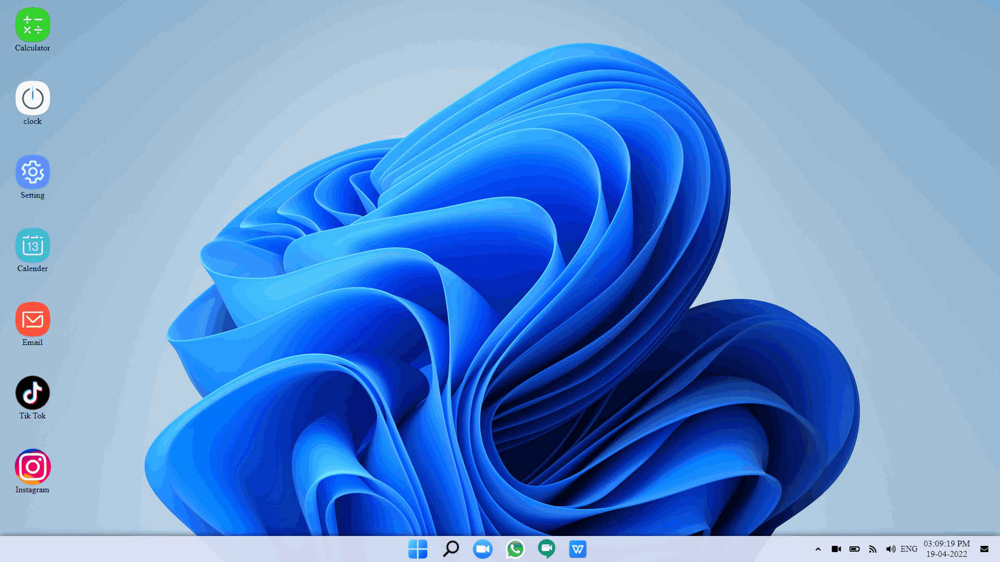
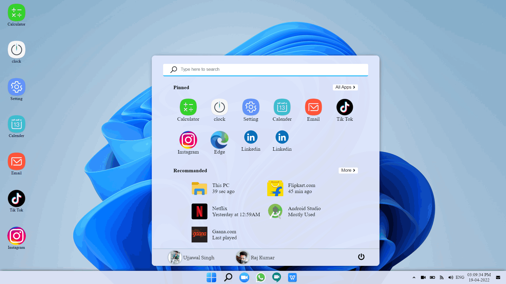

# 
 Welcome🙏🏻 
 Hi, I'm Raj! 

I'm a 3rd Year Engineering Student, & I'm confident to work on the projects with my own experience & skills...

- Web Development,
    - FrontEnd: React | HTML, CSS, JavaScript
    - BackEnd: Django | Node | JSP
    - Database: MongoDB | OracleSQL
- Android Application Development(React Native)
- Coding Skills in Java (DSA)
- Additional Skills: JavaScript, Python, ML/AI

 

# 
Project Demonstration

### Screenshots

